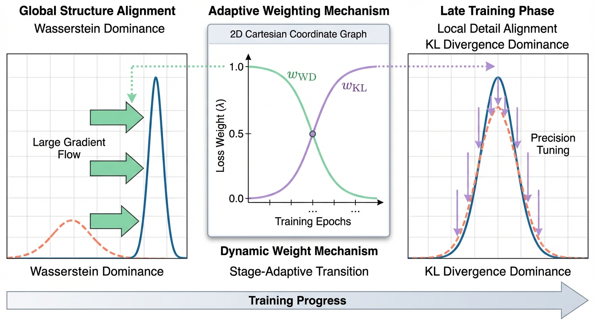

# WKL
Code for the paper: Stage-Adaptive Knowledge Distillation via KL-Wasserstein Hybrid Distribution Alignment

Abstract: Knowledge distillation commonly aligns the teacher and student output distributions using the Kullback--Leibler (KL) divergence, while recent studies have shown that Wasserstein distance can provide complementary geometric alignment. However, how these two divergences behave across different stages of distillation remains insufficiently characterized, which limits principled designs that exploit their respective strengths. In this paper, we first develop a set of quantitative alignment diagnostics that decompose teacher--student discrepancy into target-class and non-target-class components, and further analyze their stage-dependent optimization behaviors from both loss and gradient perspectives. Based on these observations, we propose a stage-adaptive mixed distillation objective that smoothly interpolates between Wasserstein distance and KL divergence via a dynamic weighting schedule. The resulting training strategy emphasizes global geometric alignment in early epochs and progressively shifts toward local, fine-grained probability matching in later epochs, leading to more coordinated teacher--student distribution alignment. Extensive experiments on CIFAR-100 and ImageNet datasets demonstrate that the proposed method consistently improves student performance across diverse settings, outperforming distillation baselines using KL divergence or Wasserstein distance alone and yielding favorable results compared with recent Wasserstein-based distillation approaches. Code is available at https://github.com/Chang-Heyu/WKL.

*Fig. 1: Overview of the proposed stage-adaptive mixed distillation objective. The training process transitions from Wasserstein-dominant global structure alignment to KL-dominant local detail refinement via a dynamic weighting schedule.*

### Loss Evolution Analysis

*Fig. 2: Loss evolution of WKL compared with KL and WKD during distillation on CIFAR-100 for the ResNet32$\times$4 $\rightarrow$ ResNet8$\times$4 setting (Part 1).*

*Fig. 3: Loss evolution of WKL compared with KL and WKD during distillation on CIFAR-100 for the ResNet32$\times$4 $\rightarrow$ ResNet8$\times$4 setting (Part 2).*

*Fig. 4: Loss evolution of WKL compared with KL and WKD during distillation on CIFAR-100 for the ResNet32$\times$4 $\rightarrow$ ResNet8$\times$4 setting (Part 3).*

*Fig. 5: Loss evolution of WKL compared with KL and WKD during distillation on CIFAR-100 for the ResNet32$\times$4 $\rightarrow$ ResNet8$\times$4 setting (Part 4).*

